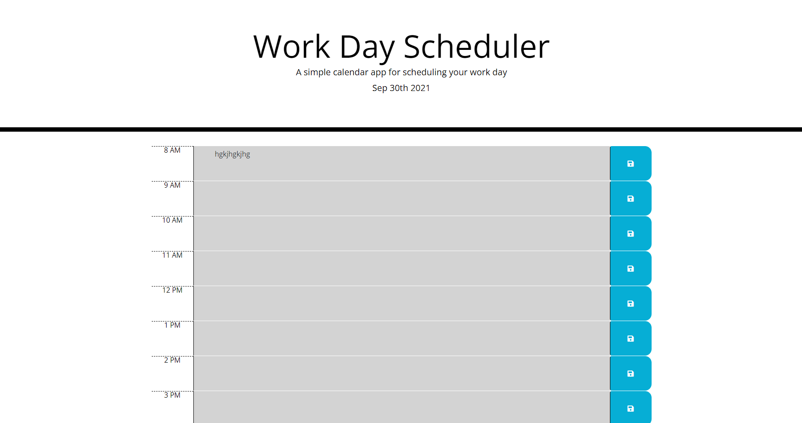

# work-day-scheduler

## Decription

This is a planner that saves anything that you put in the text area as long as you press the save button and it saves on the browser. This project helped increase my understanding of jQuery and moment.

## Usage

All that needs to be done is to click on the textarea next to the hour you want, type in your planner activity, and then hit the save button next to it. The color of the background of the text are tell three different things:
    Green: Not the time yet;
    Red: Current hour;
    Gray: the hour has past

## Credits

My friend Don has given some help with the JS

## link

https://axumdzn.github.io/work-day-scheduler/
